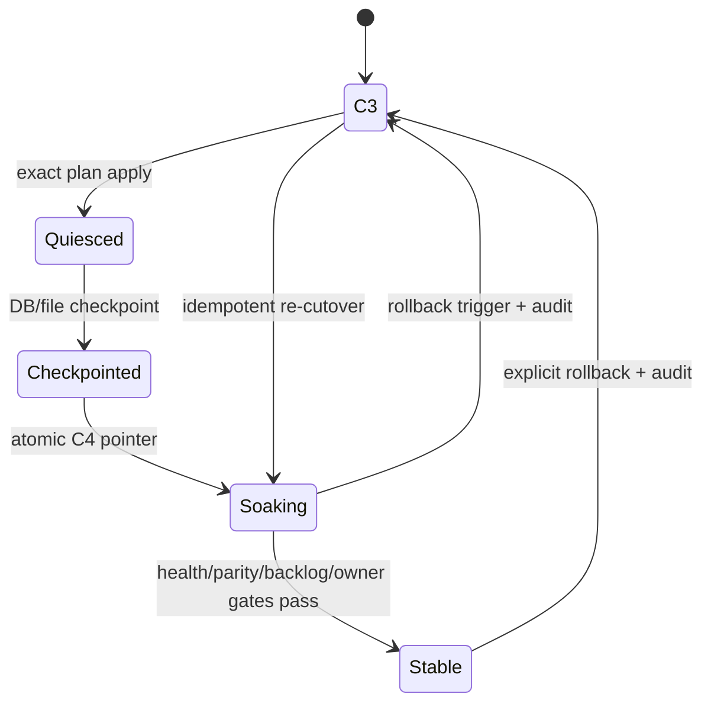

# Canonical C4 cutover and rollback

> Last verified: 2026-07-23 · GOL-57. Run every command against an explicit
> disposable or operator-approved `--home`; no cutover command infers a home.

## Authority contract

`$GOLEM_HOME/control-plane/authority.json` is the only source switch. Its
atomic rename chooses both the runtime database and the legacy-writer policy:

| Pointer | Runtime authority | Tracker authority | Legacy writes |
|---|---|---|---|
| absent or `C3/legacy_open` | `$GOLEM_HOME/runtime.db` | `$GOLEM_HOME/tracker.db` | allowed |
| `C3/quiesced` | no new owner may write | unchanged | rejected with `GOLEM_LEGACY_WRITER_QUIESCED` |
| `C4/canonical_only` | `$GOLEM_HOME/canonical/runtime.db` | `$GOLEM_HOME/tracker.db` | rejected with `GOLEM_LEGACY_WRITER_RETIRED` |

Tracker deliberately remains its own authority, as required by GOL-20. The
compatibility migration's adjacent tracker database is migration scratch; C4
never substitutes it for real tracker history.

The durable cutover state is
`$GOLEM_HOME/control-plane/cutover-state.json`. A process crash can leave
`quiesced`, `checkpointed`, or `soaking`; reapplying the same exact plan hash
resumes from that state. A different plan is rejected.



## Operator sequence

Build and pass the migration gates first:

```bash
golem migrate plan --home "$GOLEM_HOME" --json
golem migrate apply --home "$GOLEM_HOME" --plan-hash <migration-sha256> --json
golem migrate cutover-plan --home "$GOLEM_HOME" --json
```

The C4 plan fails closed unless it can prove:

- applied exact migration and matching backup manifest;
- exact service binary, persistence schema, and migration hashes;
- no project/session/fact/lease/channel/bridge/supervisor delta since the
  imported snapshot (Tracker remains an independent authority and may advance);
- zero required parity gaps, unsafe backlog, or strong identity conflicts;
- no duplicate service owner (one before quiesce, zero while stopped);
- every enabled preset is qualified;
- typed API and UI smoke success;
- sufficient checkpoint space;
- canonical project/session counts and revision match the generated projection;
- the retained tracker authority is present.

Each failed gate returns one stable code and remedy. Correct the cause and
generate a new plan; do not edit the plan JSON or authority pointer manually.

Apply only the reviewed hash:

```bash
golem migrate cutover-apply --home "$GOLEM_HOME" --plan-hash <cutover-sha256> --json
golem dashboard
golem migrate cutover-soak --home "$GOLEM_HOME" --json
```

After C4, `golem dashboard` starts the authenticated typed control plane and
serves `dashboard/dist/control-plane`. Claude/OpenCode renders invoke the
relocatable `mcp/golem-mcp.mjs`; the local service token is read from
`$GOLEM_HOME/control-plane/service-token`. Raw credentials are never written
to discovery, cutover state, receipts, or rollback audit.

## Checkpoint, crash, and soak behavior

The checkpoint under
`$GOLEM_HOME/cutover-backups/<plan-prefix>/manifest.json` records the exact
binary/schema/migration hashes and copies the pre-switch runtime/tracker
database files, config, render lock/render tree, service definition, and
canonical target. Existing user files are not deleted or rewritten.

A crash:

- before the authority rename leaves `C3/quiesced`;
- after a process death leaves a recoverable stale operation lock;
- after the checkpoint leaves a resumable checkpoint;
- after the rename leaves one complete `C4/canonical_only` pointer;
- after rollback's authority rename resumes the existing audit on restart;
- never causes a reader to combine C3 and C4 stores.

Soak checks parity, service health, backlog, and owner uniqueness. A regression
is visible as `rollback_required` or invokes the default automatic rollback;
there is no silent legacy fallback.

## Rollback

```bash
golem migrate cutover-rollback --home "$GOLEM_HOME" --json
golem dashboard
npm run test:legacy-baseline
```

Rollback first copies canonical database/compatibility artifacts and their
hashes into
`$GOLEM_HOME/cutover-audit/<timestamp>/rollback-audit.json`. It then atomically
restores `C3/legacy_open`. It does **not** delete or downgrade canonical data,
tracker history, journals, gates, registries, renders, or backups. Config,
render, and service artifacts were never mutated by this C4 switch; the
checkpoint supplies the exact prior bytes for a separately approved artifact
rollback if an update changed them.

If post-cutover facts cannot be represented by an old consumer, the audit
retains them and rollback reports the gap. Never restore an older database over
new user work.

## Retired path matrix

| Legacy artifact/path | C4 classification | Replacement / gate |
|---|---|---|
| `projects.json`, `sessions.json` | retained import history; writer removed | canonical runtime project/session services; revisioned `compatibility/legacy-projection.json` for old reads |
| `session-facts.json` | retained history; writer removed | typed runtime signals and materializer |
| `endpoint-leases.json` | retained history; writer removed | generation-scoped endpoint storage and fences |
| `channels.json` | retained rollback history; legacy server fenced | typed MCP/API delivery and canonical endpoint eligibility |
| `opencode-bridges.json` | retained rollback history; writes suppressed | OpenCode typed runtime ingress; pull-only remains explicit until a fenced owner exists |
| `codex-supervisors.json` | retained rollback history; writer removed | typed managed Codex host and canonical endpoints |
| `dashboard/server/**` reconciliation/timers/routes | executable retained only for C3 rollback; startup fenced at C4 | `apps/control-plane` REST/WS/static service |
| `dashboard.json` | generated/non-authoritative discovery | typed service health and instance identity |
| root `tracker.db` | **retained authority**, not retired | typed tracker repositories/services with canonical references |
| journals, gates, ideas, roles | retained history/management input; never deleted | typed management/tracker storage as each consumer crosses its gate |
| `config.json`, `substrate.lock`, `renders/**` | integration state, checkpointed; not runtime identity | settings/compiler managed writes and GOL-59 artifact update/rollback |
| `mcp/channel/index.js` | rollback-only executable; C4 startup fenced | relocatable `packages/mcp-adapter/dist/golem-mcp.mjs` |
| legacy root CLI role/supervisor writers | C4 guard with explicit rollback remedy | typed CLI/control-plane commands |

`C5` source removal is a later retention decision. C4 removes authority, not
user data or the ability to perform a versioned rollback.
