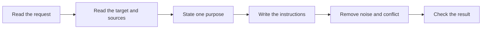

<!-- GENERATED: skills/skill-authoring/SKILL.md — rendered by `golem sync` from substrate/ — edit the source, not this file. -->

# Skill authoring

Write the requested instructions. Do not design the system that loads, evaluates, or enforces them.

## Boundary

| In scope | Out of scope |
|---|---|
| Skill name, description, front matter, and body | Skill loading, matching, or runtime evaluation |
| Agent-persona instruction body | Roles, agent topology, delegation, model choice, or permissions |
| Clear structure, language, examples, and references | Hooks, CI, tools, scripts, or other enforcement |
| Revision of existing instructions | Automatic rules based on past failures |

Writing instructions does not authorize supporting code or configuration. Add a supporting file
only when the requested instructions require stable detail that does not fit in the main file.

## Method

1. **Read.** Read the user request, the current target, and every source needed for factual claims.
2. **Set the purpose.** Complete this sentence: `These instructions help the agent ___`.
3. **Set the contract.** Identify the inputs, actions, boundaries, and expected result.
4. **Write.** Put actions in execution order. Use a table for mappings and a list for a sequence.
5. **Reduce.** Remove duplication, generic advice, unrelated rationale, and conflicting terms.
6. **Check.** Confirm the description, front matter, references, language, and completion condition.

## Content map

| Part | Write |
|---|---|
| `description` | What the instruction set does and when to use it |
| Purpose | The result the agent must produce |
| Inputs | Context or source material the agent needs |
| Method | Actions in the order that matters |
| Boundaries | Only limits needed to prevent a likely wrong action |
| Completion | An observable result or stop condition |
| References | Stable detail needed for some, but not all, uses |

For exact front-matter guidance, read
[references/frontmatter.md](references/frontmatter.md).

For an agent persona, also read
[references/persona-writing.md](references/persona-writing.md).

## Language

| Use | Avoid |
|---|---|
| Short sentences with one main instruction | Several requirements in one sentence |
| Active voice and direct verbs | Passive or indirect commands |
| Common technical terms | Idioms, slogans, metaphors, and decorative jargon |
| One term for one concept | Synonyms for the same role, state, or artifact |
| Concrete actions and results | Generic advice such as “follow best practices” |
| Positive instructions where practical | Long lists of prohibitions |

Define an acronym at first use. State a necessary reason when it helps the agent apply a boundary
correctly. Do not preserve history in an active instruction unless that history changes the action.

## Editorial check

- [ ] The purpose is one sentence.
- [ ] The description says what the instructions do and when they apply.
- [ ] Every factual statement comes from a source that was read.
- [ ] The agent can identify its inputs, next action, and stop condition.
- [ ] Each operational rule has one owner.
- [ ] No line creates work outside the user's request.
- [ ] No instruction requires runtime evaluation by the writer.
- [ ] The text uses consistent, plain technical language.
- [ ] Every reference exists and is linked from the main file.

The human evaluates runtime behavior. Finish when the instructions and their references are clear,
complete, and structurally valid.
