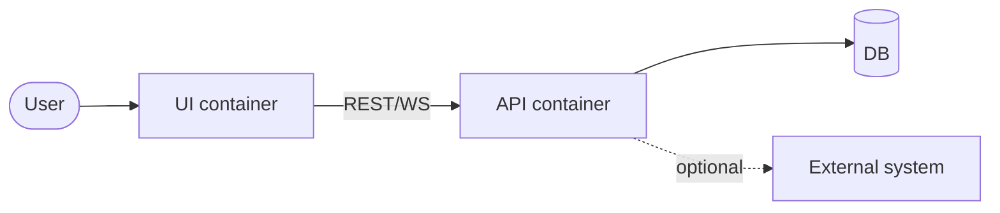

# Design: <subject>

> [!NOTE]
> arc42 MVP — Overview, Context, ADRs. Grow each section only when the
> design actually demands it; an empty heading is a TODO, not a failure.

## Overview

One paragraph: what system this is, what it does for a user, and the one or
two design forces that shape everything below (latency, single-writer,
no-build-step, etc.).

## Context

The constraints you can't change — language, runtime, existing systems you
must integrate with, scale envelope. Be specific about numbers where they
bite ("must stay under 200ms p99 at 50 QPS").

## Container view

The big picture, as a C4 container diagram. Show the major actors + the
system's own containers + the data flow between them.

## Key decisions (ADRs)

One subsection per architectural decision. Each carries its own
Context → Decision → Consequences; rejected alternatives sit under the
relevant decision, not in a global dumping ground.

### ADR-1: <decision title>

- **Context:** the force that pushes you to decide
- **Decision:** what you chose
- **Consequences:** what this buys you and what it costs

Rejected alternatives:

- *<alt A>* — rejected because <why>
- *<alt B>* — rejected because <why>

## Open questions

1. ...
2. ...