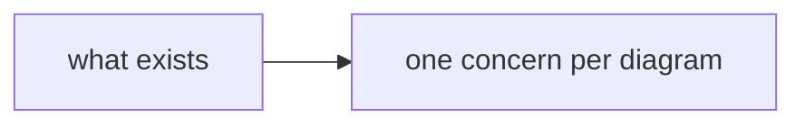
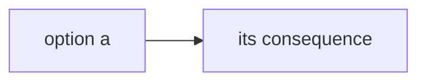

# Doc: <short title — what this page answers or explores>

<!-- FORM RULES — keep this comment block; it governs how every section below is written.
Goal: maximum human scan-efficiency. Diagrams over prose. Tables over lists. Bullets over
paragraphs. STE: short sentences, active voice, one term per concept.
Emoji anchors (one meaning each, never decorative — same vocabulary as Global Rules):
  ✅ done/pass · ❌ fail/rejected · ⚠️ risk/caveat · 🔒 locked · ❓ open · 🎯 goal ·
  🚫 non-goal · 📌 load-bearing fact · ▶ next/action
Contrast: > [!NOTE] context · > [!WARNING] risk · > [!IMPORTANT] locked/critical.
No inline HTML color/style spans.
Diagram palette — same as templates/spec, pick by relevance, ONE concern per diagram, one-line
caption under each: flowchart · sequenceDiagram · classDiagram · erDiagram · stateDiagram-v2 ·
journey · timeline · eventmodeling (command → event → read-model loops ONLY) · quadrantChart.
Mermaid gotchas: no ";" inside sequenceDiagram message text; escape "|" as "\|" inside table
cells; blank line after 
 before markdown; the body must never START with an HTML tag.
Validate every block before saving: mermaid-cli exits 0 even on broken langium-based types —
render to SVG and check it for an error marker, not just the exit code.
One template, two shapes — keep the sections the job needs, delete the rest:
  research/exploration → Question · Summary · Findings · Implications · Method
  brainstorm scratchpad → Question · Summary · one ❓ section per decision
-->

## Question

<!-- form: the commission in 1–2 lines — what this doc answers, or which decisions it explores,
and for which spec or decision (name the parent). -->

## Summary

<!-- form: the standing answer up front, ≤7 STE bullets — most readers read only this; keep it
current as the page evolves. Scratchpad shape: which decisions are 🔒 decided, which stay ❓
open, what ▶ awaits whom. -->

- <bullet>

## Findings

<!-- form: research shape. Facts with evidence, diagram-first: palette diagrams with captions
for shape and structure, 📌 bullets for facts a diagram cannot carry, tables for comparisons.
ALL file:line refs live in the collapsed Evidence table — never inline in the reading flow. -->

*Caption: <one line — what this diagram shows>.*

- 📌 <fact a diagram cannot carry>

### Evidence

fact → source refs

| 📌 Fact | Refs |
|---|---|
| <fact> | `path/file.ext:12-34` |

## ❓ <decision title>

<!-- form: scratchpad shape — one section per decision, worked one decision at a time. Give the
human what he needs to decide fully deliberately: context, options with concrete impact, a
comparison diagram where it helps. This is his comment surface — expect replies on the spec, on
this scratchpad, and in chat.
On decide: retitle the section 🔒, record the call + why as bullets, wrap the worked material in

. The call folds into the parent spec at a boundary or on the human's directive. -->

- Context: <what forces this decision>

| Option | What it entails | Impact / trade-off |
|---|---|---|
| <a> | <what choosing it means, concretely> | <consequence, cost, risk> |

*Caption: <one line — what choosing this looks like>.*

- Recommendation: <yours, with the reason>

## Implications

<!-- form: optional — what the findings mean for the commissioning spec or decision, plus your
recommendation. Delete when not needed. -->

## Method

<!-- form: optional — how this was gathered: commands run, sources consulted, scope covered.
Keep when credibility or reproducibility matters; delete otherwise. -->
