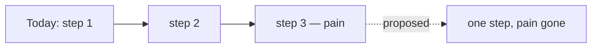

# Feature: <one-line pitch>

## Problem

What's the concrete pain today? Name who hits it and what they're forced to do.
One paragraph — if you can't state the problem in three sentences, you don't
understand it yet.

## Appetite

How much time is this worth? Pick one: **small** (1–2 days), **medium** (~1
week), **big** (2+ weeks, needs a real pitch). State the budget honestly — it
forces the scope below to fit, not the other way around.

## Solution sketch

Sketch the shape of the fix in prose or a quick diagram. Not a spec — the
*shape*, so a reader can see what changes for the user.

## Context notes (orientation, not boundary)

Optional for tiny fixes; expected for larger executable items. Use this for repo
map excerpts, LSP/symbol hints, prior research, or likely files to inspect.
Workers still verify from source and dig deeper whenever needed. Workers should
comment when these notes are stale, misleading, or incomplete.

## Rabbit holes

Where could this get stuck or balloon? List the two or three places you'd
overspend if you weren't watching. Mark the one you're explicitly narrowing.

- *Narrowing:* <which rabbit hole are you cutting, and how>

## No-gos

Explicitly out of scope for this batch. Anything that would be nice but is
deferred goes here, not in the solution.

## Acceptance

What does "done" look like? Concrete, observable outcomes — not tasks.

- [ ] Outcome 1
- [ ] Outcome 2
- [ ] Outcome 3

## Open questions

Things you don't know yet but will need to resolve to ship.

1. ...
2. ...
