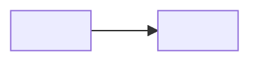

# Spec: <subject>

<!-- FORM RULES — keep this comment block; it governs how every section below is written.
Goal: maximum human scan-efficiency. Diagrams over prose. Tables over lists. Bullets over
paragraphs. STE: short sentences, active voice, one term per concept.
Emoji anchors (one meaning each, never decorative — same vocabulary as Global Rules):
  ✅ done/pass · ❌ fail/rejected · ⚠️ risk/caveat · 🔒 locked · ❓ open · 🎯 goal ·
  🚫 non-goal · 📌 load-bearing fact · ▶ next/action
Contrast: > [!NOTE] context · > [!WARNING] risk · > [!IMPORTANT] locked/critical.
No inline HTML color/style spans.
Diagram palette — pick by relevance, ONE concern per diagram, several small over one crammed:
  flowchart (+subgraphs): architecture, topology, wiring, control/data flow
  sequenceDiagram: protocols, cross-service interactions over time
  classDiagram: data models, types, ontology
  erDiagram: storage schemas, entities + cardinality
  stateDiagram-v2: lifecycles, state machines
  journey: user/UX flows
  timeline: rollout/migration phases
  eventmodeling: command → event → read-model loops ONLY (rigid grammar: no spaces in names,
    numeric frame ids, enforced ui→cmd→evt→rmo chains — do not force other shapes into it)
  quadrantChart: option positioning (rare)
Prefer tall over wide — a wide, shallow diagram reads poorly; re-orient (flowchart TD) or
split rather than widen.
Color keys meaning: one meaning per hue per diagram, muted mid-tone fills (classDef) legible
on light and dark themes; never decorative.
Mermaid gotchas: no ";" inside sequenceDiagram message text; escape "|" as "\|" inside table
cells; blank line after 
 before markdown; the body must never START with an HTML tag.
Validate every block before saving: mermaid-cli exits 0 even on broken langium-based types
(eventmodeling) — render to SVG and check it for an error marker, not just the exit code.
-->

## 1. TLDR

<!-- form: ≤7 short ASD-STE100 bullets — clauses with anchors, not paragraph-length sentences — then
one status line. -->

- <bullet>

**Status:** <one line — where this spec stands, what awaits whom>

## 2. Intent

<!-- form: short prose — the canonical why. Raw thoughts verbatim in the collapsed block. -->

Raw thoughts (preserved verbatim)

<original notes — never rewritten>

## 3. Grounding

<!-- form: CURRENT reality, diagram-first. 1-6 (depending on scope/complexity) palette diagrams showing what exists today
(topology, data shape, lifecycle — whichever are load-bearing), one-line caption under each.
📌 bullets only for facts a diagram cannot carry (constraints, numbers, gotchas).
ALL file:line refs live in the collapsed Evidence table — never inline in the reading flow. -->

*Caption: <one line — what this diagram shows>.*

- 📌 <fact a diagram cannot carry>

### Evidence

fact → source refs

<!-- form: columns flex to the spec — add a Repo column for multi-repo grounding. -->

| 📌 Fact | Refs |
|---|---|
| <fact> | `path/file.ext:12-34`, `path/other.ext:56` |

## 4. Requirements

<!-- form: three tables, no prose between them. The Value/Measure columns are optional — drop
them when a requirement is its own value; do not invent framing to fill a cell. -->

### 🎯 Goals & Functional Requirements

| # | Requirement | Value |
|---|---|---|
| G1 | <requirement, checkable> | <why it matters> |

### Qualities & Non-functional Requirements

| Quality | Constraint | Measure |
|---|---|---|
| <quality> | <the limit it imposes> | <how it is judged> |

### 🚫 Non-goals

| Non-goal | Why excluded |
|---|---|
| <exclusion> | <reason> |

## 5. Decisions

<!-- form: the master table is the glance index — every decision gets a row with a one-line
call. Status = emoji + optional qualifier ("🔒 pending sign-off", "❓ recommendation drafted").
Below the table, EVERY decision keeps a block in the ONE canonical shape. Decisions live here
and only here — a scratchpad doc (templates/doc) explores and informs them, never duplicates
them; link it via Trail:.
  ❓ open — expanded: Context / Options table / Recommendation (the human's comment surface);
    may carry one comparison diagram — deeper exploration goes to the scratchpad;
  🔒 decided — 
 with Call / Why / Rejected (each alternative, one-line reason) /
    Consequences (optional) / Trail: scratchpad doc id (optional, when one exists).
On decide: update the row, rewrite the block as decided, collapse it. -->

| D# | Decision | Status | Call |
|---|---|---|---|
| D1 | <title> | 🔒 | <one-line call> |
| D2 | <title> | ❓ | see below |

🔒 D1 — <title> — <one-line call>

- Call: <what was decided>
- Why: <the reason>
- Rejected: <alternative — one-line reason> · <alternative — one-line reason>
- Consequences: <grounded consequences worth keeping — optional>
- Trail: <scratchpad doc id — optional, when one exists>

### ❓ D2 — <title>

- Context: <what forces this decision>

| Option | Entails | Trade-off |
|---|---|---|
| <a> | <what choosing it means, concretely> | <consequence, cost, risk> |

- Recommendation: <yours, with the reason>

## 6. Design

<!-- form: the LARGEST section of a locked spec. Target reality in ~3-7 (depending on scope/complexity) subsections chosen by
relevance from: Architecture · Components · Data model · Schema/storage · Interfaces & APIs ·
Control flow · Data flow · Lifecycles · UX journey. Each subsection: its palette-matched
diagram(s) + technical bullets keyed to D#. APIs and contracts as tables. -->

### Architecture

- <technical bullet, keyed to D#>

### Interfaces & APIs

| Endpoint | In | Out | Notes |
|---|---|---|---|

## 7. Acceptance Criteria

<!-- form: comprehensive table checklist. Every scenario agent-runnable (do X, observe Z). "Verify by" states
the probe when known; mark inferred probes as such rather than inventing certainty.
Status: ⬜ todo · ✅ pass · ❌ fail -->

| # | Scenario | Verify by | Status |
|---|---|---|---|
| A1 | <do X, observe Z> | <command / page / probe> | ⬜ |

## Rollout

<!-- form: optional — delete unless migration/sequencing is real. timeline diagram + steps
table. -->
