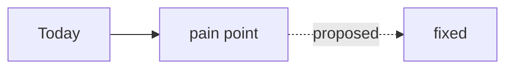

# tracker

The tracker is THE source of truth for work — it **replaces PLAN.md**. The
dashboard owns the SQLite DB (single writer); you read/write it through the
golem channel MCP tools below. Your session id and project are injected for you,
so you rarely pass ids.

Agents: send Markdown. The server stores it verbatim and the dashboard renders
it client-side: headings, lists, GFM tables, fenced code, fenced ```mermaid
diagrams, and GitHub-style admonitions (`> [!NOTE]` / `> [!WARNING]` /
`> [!IMPORTANT]`). Plain text is tolerated but prefer Markdown — it's cheaper
and renders correctly everywhere.

````markdown
# Headline goes here

Single paragraph summarising the ticket. One or two sentences is plenty.

## Why this matters

A one-paragraph thesis that the rest of the section supports. Body paragraph,
then a list or table as needed.

- First concrete outcome.
- Second concrete outcome.

| Phase | State |
|-------|-------|
| today | pain |
| proposed | fixed |



> [!NOTE]
> Use `[!NOTE]` for neutral callouts, `[!WARNING]` for risks, `[!IMPORTANT]`
> for load-bearing context.

## What done looks like

- [ ] Outcome 1
- [ ] Outcome 2
````

**Genre templates.** Pick the template that matches the ticket kind and fill
it in — they're tension-forcing scaffolds, not cages:

- `work-item` → `templates/feature.md` — Problem / Appetite / Solution sketch / optional Context notes (orientation, not boundary) / Rabbit holes / No-gos / Acceptance
- `fix` → `templates/bug.md` — Repro / Expected / Actual / Environment / Suspected cause / Fix
- `spec` → `templates/design-doc.md` — arc42 MVP + C4 container diagram + ADRs
- `decision` → `templates/decision.md` — MADR bare-minimum: Status / Context / Decision / Consequences / Rejected alternatives
- `prd` → `templates/prd.md` — Problem / Audience / Success criteria / Non-goals
- `brainstorm` → `templates/brainstorm.md` — Question / Options with tradeoffs / Verdicts

Files live at `plugin/skills/tracker/templates/*.md` in this repo, or query
`GET /api/templates` on the dashboard for the live list. The create-ticket UI
picks a default by kind (work-item→feature, fix→bug, spec→design-doc,
decision→decision; prd/brainstorm selectable) and pre-fills the body only when
it's empty.

| Tool | Use |
|------|-----|
| `ticket_list({mine:true})` | find work assigned to YOU |
| `ticket_get({id})` | read a ticket: Markdown body, anchored comments, thread, history |
| `ticket_create({title, body, …})` | create a ticket (defaults to your project; you = created_by) |
| `ticket_update({id, state})` | transition state / patch fields (you = actor) |
| `ticket_comment({id, body, …})` | progress note with mechanical evidence (you = author) |
| `ticket_comment_update({id, comment_id, body, tag, status})` | edit a comment or mark it resolved/open |
| `ticket_comment_reply({id, comment_id, body})` | thread a reply under an existing comment |
| `ticket_dispatch({id, session_id})` | hand a ticket to a live session |
| `stream_create / stream_list` | group tickets (mode sequential\|parallel) |
| `sessions_dispatchable` | live sessions that can receive a dispatch |

Kinds: `work-item | decision | spec | question | fix`.
States: `todo → in_progress → review → done` (or `blocked`, `archived`).

Comment tags: `confirmed | partial | disputed | fix | risk | question | note`.
Comment status: `open | resolved`.

## Flow on a brief / dispatch

1. **Find your work** — `ticket_list({mine:true})`, or the ticket id named in the
   dispatch brief. `ticket_get` it to read the full Markdown body + thread.
2. **Claim it** — `ticket_update({id, state:'in_progress'})`. One in-progress
   ticket at a time per work-stream.
3. **Do the work**, then `ticket_comment` progress with MECHANICAL evidence
   (commands you ran + their real output), never bare claims.
4. **Verify, then advance** — run the relevant checks (`golem:verify-done`)
   BEFORE moving to `review`/`done`. A claim is not evidence.

## Decompose larger work

- Break it into sub-tickets: `ticket_create({parent_id:'<id>', …})`.
- Optionally group them: `stream_create({name, mode})` then create the children
  with that `stream_id`. `sequential` = one in-progress at a time; `parallel` =
  independent sub-work.

## Blocking question for the human

- `ticket_create({kind:'question', assignee:'human', title, body})`, then **pause
  that thread** — do not guess past the blocker.
- The human answers via a comment on that ticket. **Resume** by re-reading it
  with `ticket_get`; act on the answer and continue.

## Annotating the body

Inline comments on the ticket body share the same `comments` table as thread
comments. The dashboard UI assigns each rendered block (heading, paragraph,
list, table, code block, diagram, callout) a `block_id` of the form
`<heading-slug>#<index-within-section>` and offers a block-hover "+" affordance
to comment on the whole block; text-select→pill lets you comment on a sub-range.
So in practice you usually just write the body and let the UI handle anchoring.
If you POST a comment via MCP and want it anchored, the anchor fields mean:

- `block_id`: primary anchor — `<heading-slug>#<index>` for the block (the UI
  assigns this on render; you rarely set it by hand).
- `quote`: the selected text, or the first ~120 chars of the block as a fallback.
  Used to re-locate the comment if the `block_id` goes stale after an edit.
- `prefix`/`suffix`: short text immediately before/after the quote, to
  disambiguate repeated phrases.
- `section` / `section_id`: optional heading text / slug of the containing
  section.
- `tag`: what kind of annotation it is (`confirmed`, `partial`, `disputed`,
  `fix`, `risk`, `question`, `note`).

Resolution is `block_id` primary → `quote` fallback → orphan. Plain thread
comments leave all anchor fields empty.

## Discipline

- One in-progress ticket at a time per work-stream.
- Verify before `done` — cross-ref `golem:verify-done`.
- Comment milestones (cross-ref `golem:journaling` for the central journal; the
  ticket thread is the work record, the journal is the mechanical trail).

## State hygiene

- Never end a turn with a ticket you own in a wrong state: finished work →
  `review` (or `done` after verify-done), abandoned/parked → comment WHY +
  `blocked` or unassign. A dispatched ticket leaves `todo` the moment you
  start it.
- Before going idle after a brief, sweep `ticket_list({mine:true})`: anything
  `in_progress` you are not actively working must be advanced, commented, or
  released.
- Stale tickets are a defect: if your own ticket is untouched >1 day, fix its
  state before starting new work.
