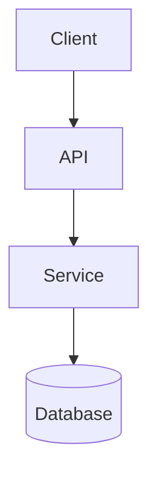

# {{PROJECT_NAME}} — Domain Context

The ubiquitous vocabulary, entity boundaries, and invariants of the project. When an agent reads this, it should be able to participate in any conversation about the project without re-deriving terms.

A term lives here when:
- It's used in conversation, tickets, commits, or code.
- A naive reader would not recognise it from English alone.
- Multiple agents have referred to it.

A term does NOT live here when:
- It's standard for the stack (`controller`, `model`, `migration`).
- It's used once, ad-hoc, in a single conversation.
- Its meaning is identical to its English meaning.

## Vocabulary

<!-- Alphabetical. Each entry: term — one-sentence definition.
     Cross-reference other terms in *italics*. Cross-reference ADRs by id.

     Example:
     - **materialisation cascade** — when promoting a *lesson* from
       outline-only to filesystem-real, every parent *section* and *course*
       node must materialise first. See ADR-0014.
     - **section** — a named bundle of *lessons*; one level above *lesson*
       and one below *course* in the *outline tree*.
-->

## Entities and boundaries

<!-- Prose under the diagram. One paragraph per bounded context: what it
     owns, what it depends on, where the boundary is. -->

## Invariants

<!-- Rules that hold across the system. Things a coding agent must not
     violate. If a change would, it needs an ADR superseding the relevant
     existing one.

     Example:
     - Domain types live in `src/<project>/domain/`; never imported into infra.
     - DB migrations are forward-only; rollback is by forward migration.
-->

- <!-- invariant 1 -->

## Open ambiguities

<!-- Terms or boundaries we have not yet pinned down. Tracked here so they
     don't get silently resolved differently in different commits. The
     Documentarian sweeps these on cadence. -->

## Pending terms

<!-- Drop terms surfaced in agent-notes when they recur but aren't yet
     promoted. Documentarian promotes to Vocabulary on sweep. -->
