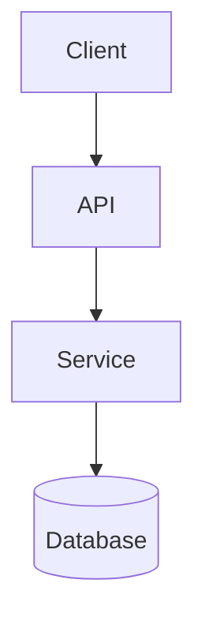

# {{PROJECT_NAME}} — Architecture

The architecture-level synthesis. ADRs are per-decision; this file is the running shape after those decisions have landed.

## Stack

- Language / runtime: {{STACK_PRIMARY}}
- Key libraries: <!-- e.g. FastAPI, SQLAlchemy 2.x, Alembic, Pydantic v2 -->
- Persistence: <!-- e.g. Postgres 16 -->
- Test runner: <!-- e.g. Pytest -->
- Lint / format: <!-- e.g. ruff, prettier -->
- Build / package: <!-- e.g. uv, pnpm -->

See `adr/0001-stack-choice.md` for rationale.

## Service / module boundaries

<!-- Brief prose under the diagram describing each module / service:
     responsibility, what it depends on, what depends on it. -->

## Cross-cutting infrastructure decisions

<!-- Auth, persistence, caching, queueing, observability. One paragraph
     each — link to the ADR that locked the choice in. -->

## Performance / scale invariants

<!-- Targets that constrain code (e.g. "all API endpoints P95 under 200ms").
     If a change would risk one, the change needs an ADR. -->

## External dependencies and SLAs

<!-- Each external service: what we use it for, what we assume about
     availability, how we degrade gracefully on outage. -->
